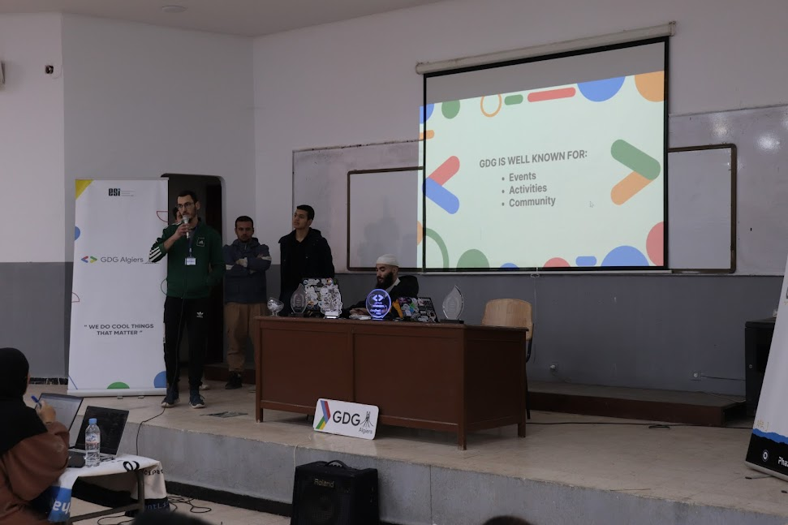
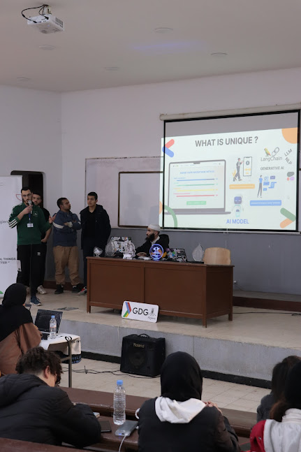
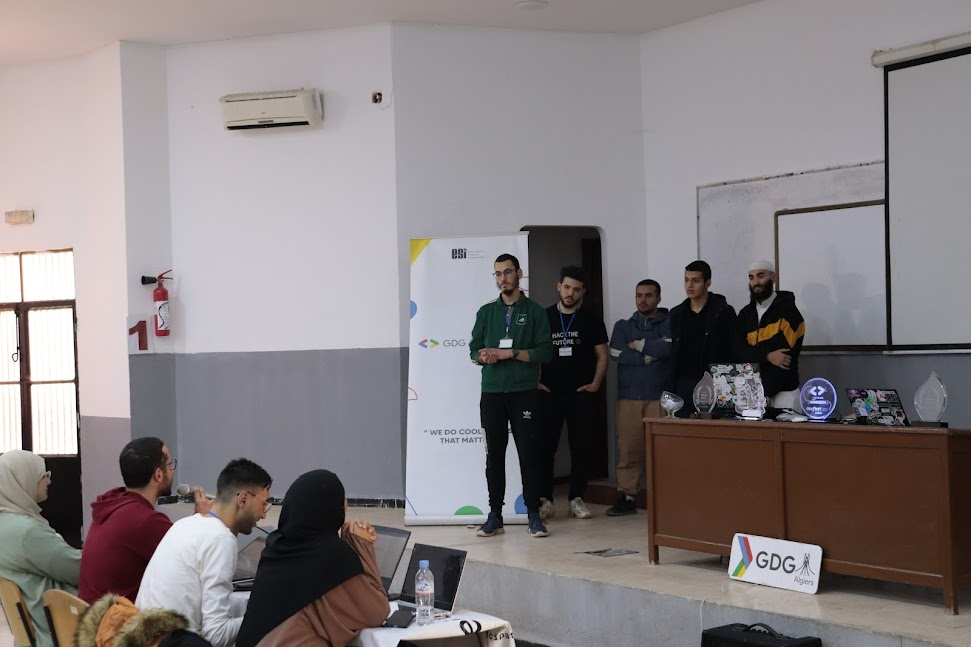
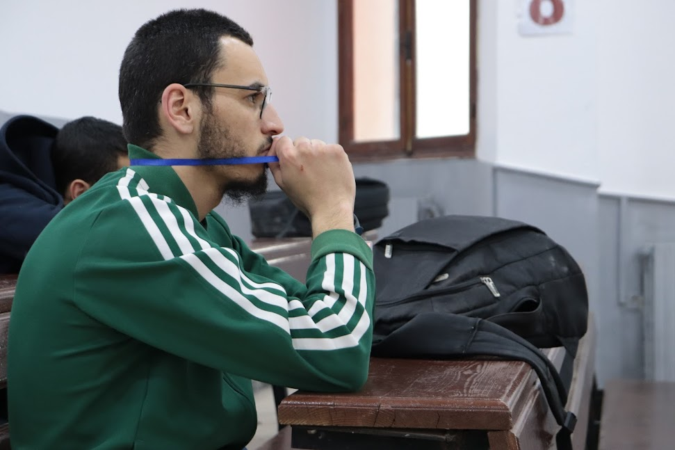
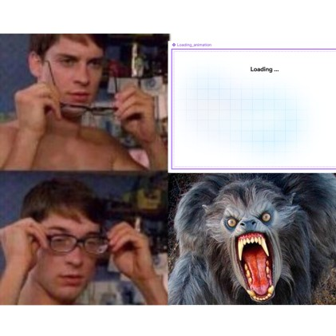

# My Journey with GDG Algiers

My time with GDG Algiers has been nothing short of incredible. From participating in the GDG Hack Internal Hackathon to giving a workshop on regression in machine learning at the GDG Dev Bootcamp, I've had the chance to grow both technically and personally. The hackathon was particularly memorable as it pushed me to collaborate with like-minded peers, and the energy of the event was electrifying. 

Equally rewarding was the opportunity to lead a workshop, where I shared my knowledge on machine learning and helped others grasp complex concepts.

I had also the opportunity to work on various projects within the development department, like ghack website and devfest 24.

Throughout my journey, I've continuously supported the community by answering questions and addressing concerns, which has been a fulfilling experience. These moments have solidified my passion for technology and community engagement, and I look forward to more adventures with GDG Algiers.
